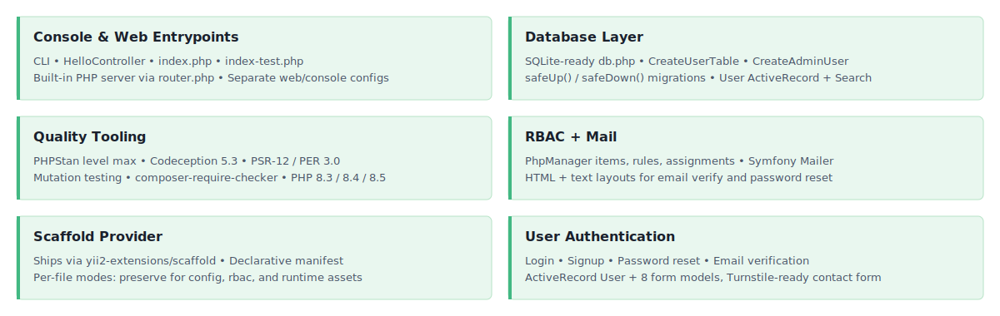

<!-- markdownlint-disable MD041 -->
<p align="center">
    <picture>
        <source media="(prefers-color-scheme: dark)" srcset="https://www.yiiframework.com/image/design/logo/yii3_full_for_dark.svg">
        <source media="(prefers-color-scheme: light)" srcset="https://www.yiiframework.com/image/design/logo/yii3_full_for_light.svg">
        
    </picture>
    <h1 align="center">App Base</h1>
    <br>
</p>
<!-- markdownlint-enable MD041 -->

<p align="center">
    <a href="https://github.com/yii2-extensions/app-base/actions/workflows/build.yml" target="_blank">
        
    </a>
    <a href="https://codecov.io/gh/yii2-extensions/app-base" target="_blank">
        
    </a>
    <a href="https://github.com/yii2-extensions/app-base/actions/workflows/static.yml" target="_blank">
        
    </a>
</p>

<p align="center">
    <strong>Shared Yii2 backend distributed as a <code>yii2-extensions/scaffold</code> provider<br>
    User model, auth, RBAC, migrations, mail, console, web entrypoints.</strong>
</p>

## Features

<picture>
    <source media="(max-width: 767px)" srcset="./docs/svgs/features-mobile.svg">
    
</picture>

## What is a scaffold provider?

`app-base` is not a runtime library; there is no class to extend or service to register.
It is a [`yii2-extensions/scaffold`][scaffold] **provider** ; a package that declares
a set of files to copy into a consumer project.

On `composer install`, the scaffold plugin reads `scaffold.json` from this package and
copies `src/`, `config/`, `rbac/`, `resources/`, `public/` and `yii` into the consumer
root. Files that are marked as `preserve` (configs, RBAC, runtime assets) are only
written once, so your edits survive subsequent installs.

See [docs/scaffold.md](docs/scaffold.md) for the detailed walkthrough.

## Requirements

- PHP `>=8.3`
- `yiisoft/yii2` `^22.0@dev`
- `yii2-extensions/scaffold` `^0.1@dev`
- A frontend overlay provider for views, CSS, and JS ; see [docs/frontend-overlays.md](docs/frontend-overlays.md).

## Quick start

Create a new directory for your app, drop in this `composer.json`, then run `composer install`:

```json
{
    "name": "my-company/my-app",
    "type": "project",
    "minimum-stability": "dev",
    "prefer-stable": true,
    "require": {
        "php": ">=8.3",
        "yii2-extensions/app-base": "^22.0@dev",
        "yii2-extensions/app-jquery": "^22.0@dev"
    },
    "require-dev": {
        "yii2-extensions/scaffold": "^0.1@dev"
    },
    "extra": {
        "scaffold": {
            "allowed-packages": [
                "yii2-extensions/app-base",
                "yii2-extensions/app-jquery"
            ]
        }
    },
    "config": {
        "allow-plugins": {
            "yii2-extensions/scaffold": true,
            "yiisoft/yii2-composer": true
        }
    }
}
```

Then:

```bash
composer install                                        # scaffold copies the tree in
./yii migrate                                           # creates the user table + admin user
php -S localhost:8080 -t public public/router.php       # start the dev server
```

Full walkthrough: [docs/installation.md](docs/installation.md).

## What ships

After `composer install`, the consumer project tree looks like this:

```text
your-app/
├── src/
│   ├── controllers/       SiteController, UserController
│   ├── models/            User ActiveRecord + 8 form models + UserSearch
│   ├── migrations/        CreateUserTable, CreateAdminUser
│   └── commands/          HelloController (console entry-point example)
├── config/                [preserve] web.php, console.php, db.php, params.php, test.php, test_db.php
├── rbac/                  [preserve] items.php, rules.php, assignments.php
├── resources/
│   ├── mail/              HTML + text templates (emailVerify, passwordResetToken) + layouts
│   └── views/             layouts/main, site/*, user/* ; rendered by the frontend overlay
├── public/                index.php, index-test.php, router.php (built-in server), assets/, images/
├── runtime/               [preserve] .gitignore (cache, logs, db.sqlite land here)
├── yii                    Console entry point
└── scaffold.json          Provider manifest (copy paths, per-file modes)
```

`[preserve]` = scaffold writes the file once and never overwrites it on subsequent
`composer install` runs. All other paths are refreshed from the provider stubs
unless you explicitly `scaffold eject` them.

## Not included (by design)

- CSS, JS, widgets, and asset bundles ; owned by frontend overlays such as
  [`yii2-extensions/app-jquery`][app-jquery].
- Server configuration (`.htaccess`, `nginx.conf`, `Caddyfile`, `.rr.yaml`) ;
  lives in dedicated `yii2-extensions/server-*` providers.

## Documentation

For detailed configuration, scaffold internals, and consumer setup.

- 📚 [Installation Guide](docs/installation.md)
- 📦 [Scaffold Workflow](docs/scaffold.md)
- ⚙️ [Configuration Reference](docs/configuration.md)
- 🎨 [Frontend Overlays](docs/frontend-overlays.md)
- 🧪 [Testing Guide](docs/testing.md)

## Package information

[](https://www.php.net/releases/8.3/en.php)
[](https://github.com/yiisoft/yii2/tree/22.0)
[](https://packagist.org/packages/yii2-extensions/app-base)
[](https://packagist.org/packages/yii2-extensions/app-base)

## Quality code

[](https://github.com/yii2-extensions/app-base/actions/workflows/static.yml)
[](https://github.com/yii2-extensions/app-base/actions/workflows/linter.yml)
[](https://github.styleci.io/repos/1216396624?branch=main)

## Our social networks

[](https://x.com/Terabytesoftw)

## License

[](LICENSE)

[app-jquery]: https://github.com/yii2-extensions/app-jquery
[scaffold]: https://github.com/yii2-extensions/scaffold
